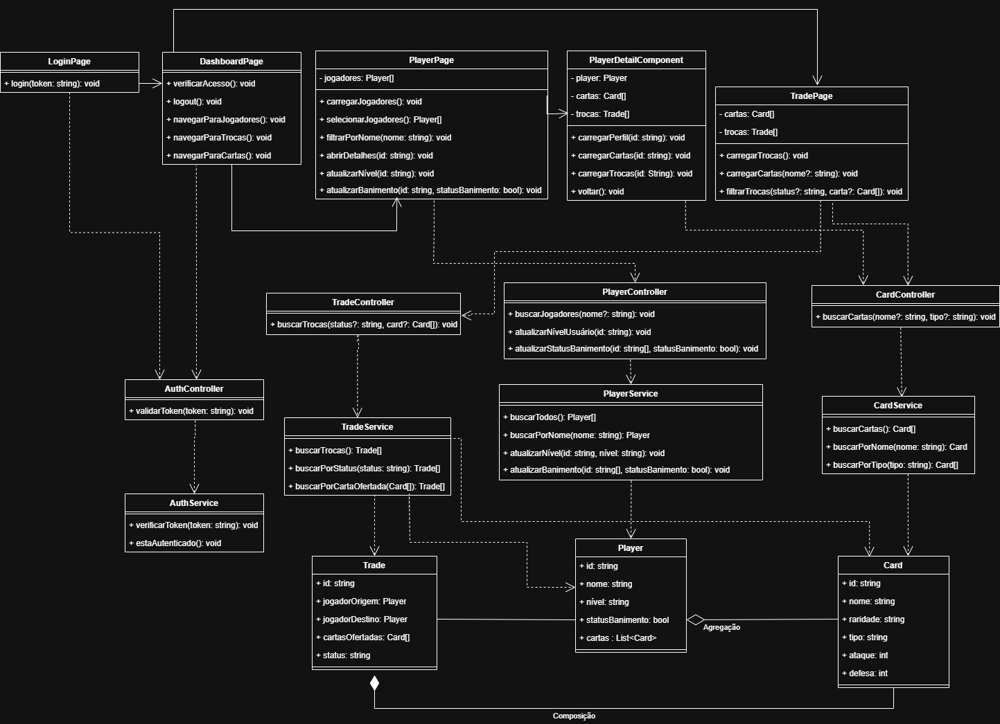

# 🛡️ Painel de Administração (Aplicação 6)
Responsável por administrar a posse de cartas na plataforma. Deve fornecer um painel administrativo com as informações dos jogadores e as cartas que eles possuem, além das trocas em aberto, propostas realizadas e histórico de trocas finalizadas.

# Funcionalidades
* **Acesso Restrito:** Login seguro e exclusivo para os administradores da plataforma.
* **Gestão de Jogadores:** Listagem e busca de usuários, permitindo banir, desbanir ou promovê-los a administrador.
* **Visão de Perfil:** Consulta detalhada do inventário (cartas possuídas) e do histórico de transações de cada jogador.
* **Catálogo de Cartas:** Listagem de todas as cartas disponíveis no ecossistema, com opção de filtro por tipo.
* **Monitoramento de Trocas:**
  * Acompanhamento em tempo real das trocas que estão em aberto.
  * Visualização dos detalhes das propostas realizadas (jogadores envolvidos e cartas ofertadas).
  * Histórico completo com o registro das trocas já finalizadas.

# Diagramas

## Princípios SOLID

A arquitetura do projeto foi analisada com base nos princípios **SOLID**, identificando os pontos já aplicados e os que podem ser melhorados futuramente.

### **S — Single Responsibility Principle** ✅ Aplicado
O projeto aplica esse princípio ao separar bem as responsabilidades entre as camadas:
- **Pages** cuidam da interface;
- **Controllers** organizam o fluxo;
- **Services** acessam dados e APIs;
- **Models** representam as entidades.

### **O — Open/Closed Principle** ❌ Não implementado diretamente
Atualmente, novos comportamentos exigem alteração em classes existentes.  
Uma melhoria futura seria criar abstrações para filtros e regras específicas, evitando modificar diretamente os services.

### **L — Liskov Substitution Principle** ➖ Não se aplica
O projeto não utiliza herança entre classes, então esse princípio não se destaca na arquitetura atual.

### **I — Interface Segregation Principle** ❌ Não implementado
Os controllers dependem diretamente dos services concretos, sem interfaces intermediárias.  
Como melhoria, poderiam ser criadas interfaces como `IPlayerService` e `ITradeService`, reduzindo acoplamento e deixando cada controller dependente apenas do que realmente usa.

### **D — Dependency Inversion Principle** ❌ Não implementado
As camadas se comunicam diretamente por implementações concretas.  
Uma evolução futura seria fazer os controllers dependerem de abstrações, o que melhoraria flexibilidade, testes e manutenção.
