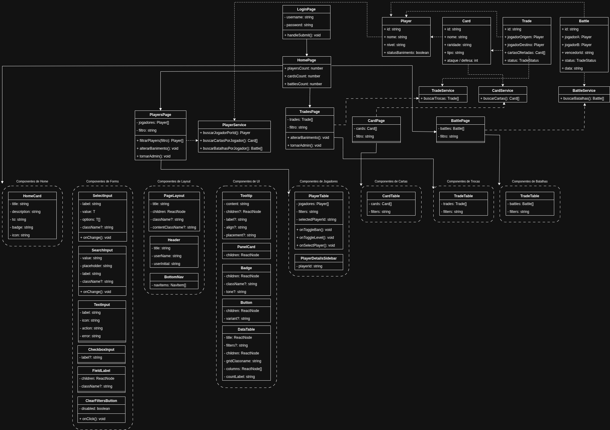
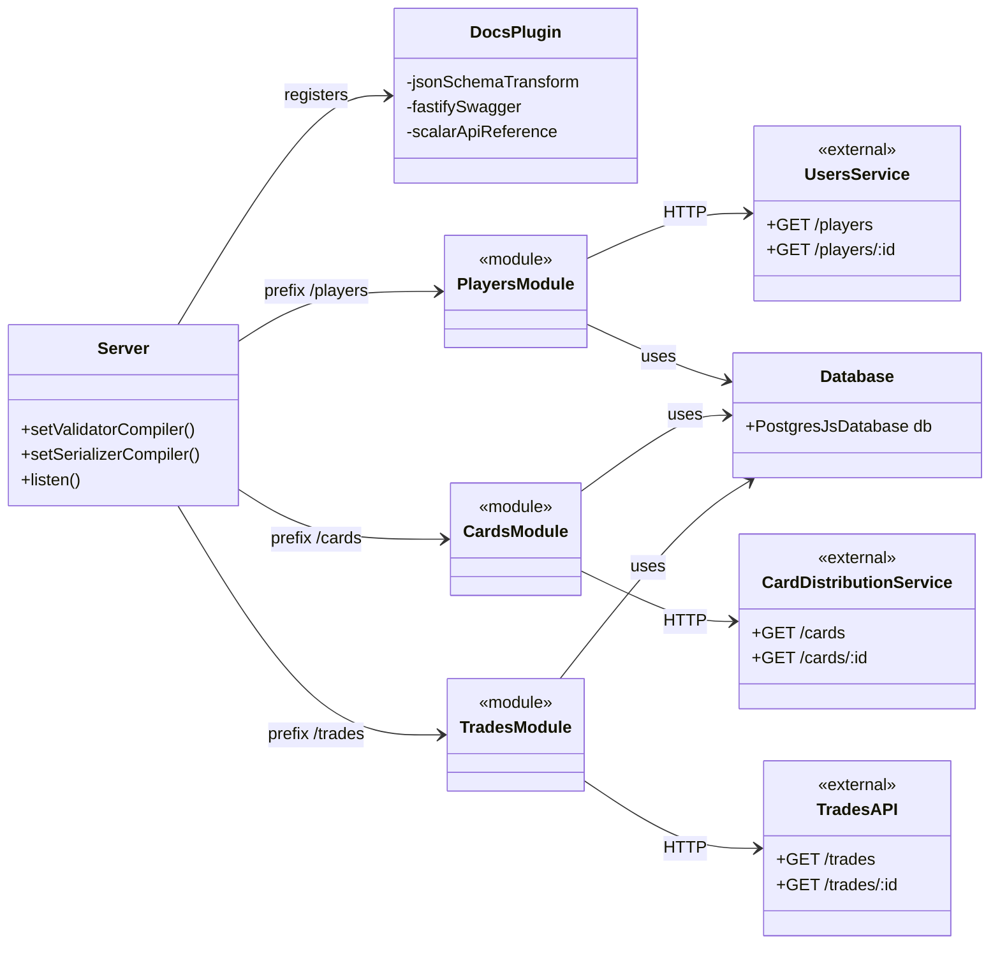
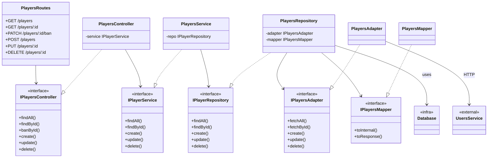
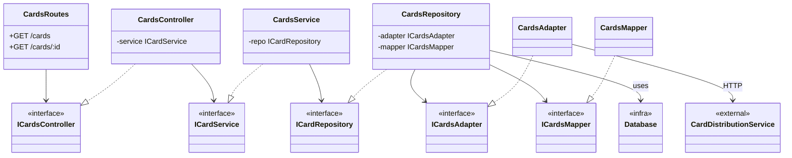
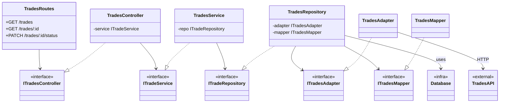
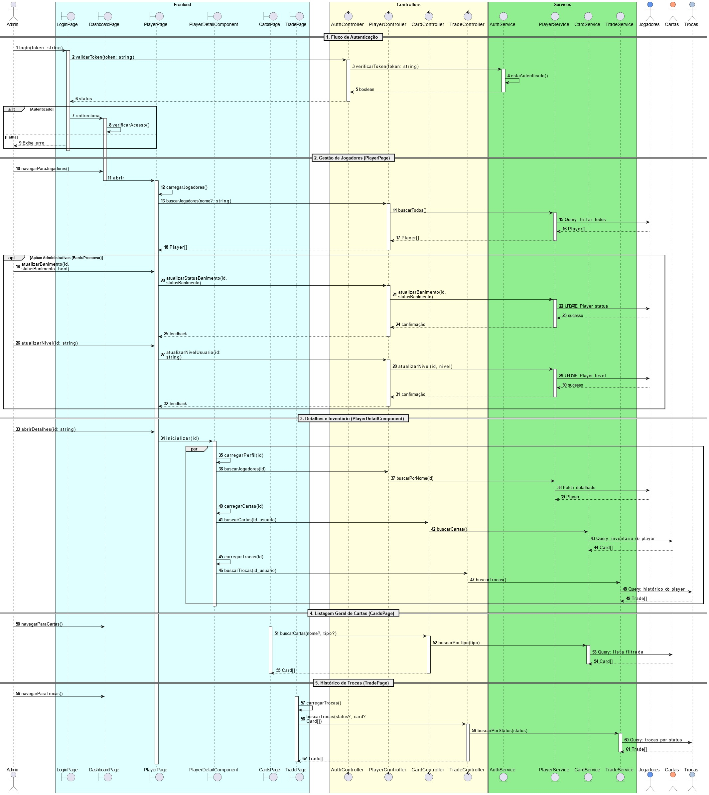

# 🛡️ Painel de Administração (Aplicação 6)
Responsável por administrar a posse de cartas na plataforma. O projeto fornece um painel administrativo em React para acompanhar jogadores, cartas, batalhas e trocas, com navegação inferior fixa.

# Funcionalidades
* **Acesso Restrito:** Login seguro e exclusivo para os administradores da plataforma.
* **Gestão de Jogadores:** Listagem e busca de usuários, permitindo banir, desbanir ou promovê-los a administrador.
* **Visão de Perfil:** Consulta detalhada em sidebar com perfil, batalhas, cartas possuídas e histórico de trocas do jogador.
* **Catálogo de Cartas:** Listagem de todas as cartas disponíveis no ecossistema, com filtros por nome, tipo e raridade.
* **Monitoramento de Batalhas:** Listagem e filtros por jogador ou status da batalha.
* **Monitoramento de Trocas:**
  * Acompanhamento em tempo real das trocas que estão em aberto.
  * Visualização dos detalhes das propostas realizadas (jogadores envolvidos e cartas ofertadas).
  * Histórico completo com o registro das trocas já finalizadas.

# Diagramas
**Diagrama de caso de uso:**

**Diagrama de classes frontend:**

**Diagrama de classes backend:**

Os três módulos (`players`, `cards`, `trades`) seguem a **mesma arquitetura em camadas**
(`Routes → Controller → Service → Repository → Adapter/Mapper → serviço externo + Database`).
Para facilitar a leitura, o diagrama foi dividido em uma **visão geral** + **um diagrama por módulo**.

### 1. Visão Geral (Overview)

Mostra como o `Server` registra a documentação e as rotas de cada módulo, e onde cada
módulo se conecta com seu serviço externo e com o banco de dados.

### 2. Módulo `players`

### 3. Módulo `cards`

### 4. Módulo `trades`

**Diagrama de sequência:**

## Princípios SOLID

A arquitetura do projeto foi analisada com base nos princípios **SOLID**, identificando os pontos já aplicados e os que podem ser melhorados futuramente.

### **S — Single Responsibility Principle** ✅ Aplicado
O projeto aplica esse princípio ao separar bem as responsabilidades entre as camadas:
- **Pages** cuidam da interface;
- **Controllers** organizam o fluxo;
- **Services** acessam dados e APIs;
- **Models** representam as entidades.

### **O — Open/Closed Principle** ❌ Não implementado diretamente
Atualmente, novos comportamentos exigem alteração em classes existentes.  
Uma melhoria futura seria criar abstrações para filtros e regras específicas, evitando modificar diretamente os services.

### **L — Liskov Substitution Principle** ➖ Não se aplica
O projeto não utiliza herança entre classes, então esse princípio não se destaca na arquitetura atual.

### **I — Interface Segregation Principle** ❌ Não implementado
Os controllers dependem diretamente dos services concretos, sem interfaces intermediárias.  
Como melhoria, poderiam ser criadas interfaces como `IPlayerService` e `ITradeService`, reduzindo acoplamento e deixando cada controller dependente apenas do que realmente usa.

### **D — Dependency Inversion Principle** ❌ Não implementado
As camadas se comunicam diretamente por implementações concretas.  
Uma evolução futura seria fazer os controllers dependerem de abstrações, o que melhoraria flexibilidade, testes e manutenção.

## Escolha das Arquiteturas

O projeto utiliza uma combinação de conceitos arquiteturais para organizar melhor a aplicação e facilitar sua evolução.

### SPA — Single Page Application

A aplicação segue o conceito de **SPA** no front-end, pois é carregada em uma única página e a navegação entre as telas acontece de forma dinâmica, sem recarregar o site inteiro. Isso deixa a experiência do usuário mais rápida e fluida.

### SOA — Service-Oriented Architecture

Também aplicamos conceitos de **SOA**, organizando o sistema em partes com responsabilidades bem definidas. A ideia é separar funcionalidades em serviços ou módulos, como jogadores, cartas e trocas, facilitando manutenção, reaproveitamento e integração com APIs externas.
