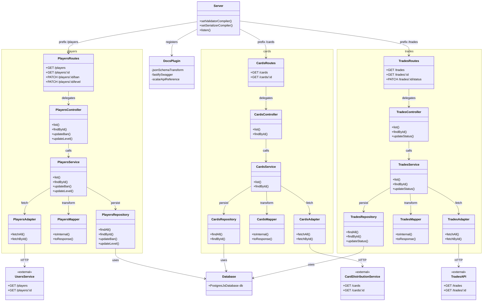

# API — Modular Architecture

Backend that consumes external services, maps the data to the internal model, and persists relevant information in the database.

---

## Directory Structure

```
api/
├── src/
│   ├── config/
│   │   └── database.ts
│   ├── db/
│   │   └── schema.ts
│   ├── modules/
│   │   ├── players/
│   │   │   ├── players.schema.ts
│   │   │   ├── players.adapter.ts
│   │   │   ├── players.mapper.ts
│   │   │   ├── players.repository.ts
│   │   │   ├── players.service.ts
│   │   │   ├── players.controller.ts
│   │   │   └── players.routes.ts
│   │   ├── cards/
│   │   │   └── (same structure)
│   │   └── trades/
│   │       └── (same structure)
│   ├── plugins/
│   │   ├── docs.ts
│   │   └── index.ts
│   └── server.ts
└── tests/
    ├── unit/
    └── integration/
```

---

## Folder Responsibilities

### `config/`
Global application settings: database connection and environment variables.

### `db/`
Database table definitions via Drizzle ORM. Single source of truth for the database schema — TypeScript types and migrations are generated from here.

### `modules/`
Each module groups all artifacts of a business entity in one place. A module contains seven layers:

| File | Responsibility |
|---|---|
| `*.schema.ts` | Zod schemas for input/output validation + derived TypeScript types |
| `*.adapter.ts` | Consumes the external service API — isolates HTTP calls and error handling |
| `*.mapper.ts` | Transforms external service responses into the internal model |
| `*.repository.ts` | Persists in the database only what the external service does not manage |
| `*.service.ts` | Orchestrates adapter, mapper and repository; enforces business rules |
| `*.controller.ts` | Parses the HTTP request and delegates to the service; returns the response |
| `*.routes.ts` | Declares endpoints, binds Zod schemas, and connects to the controller |

### `plugins/`
Fastify plugins registered globally before routes: OpenAPI docs (Swagger + Scalar), auth, CORS, rate-limit, etc.

### `tests/unit/`
Tests services and functions in isolation, without a real database or HTTP calls.

### `tests/integration/`
Tests the full application flow with a real or mocked database.

---

## Request Flow

```
server.ts
   └─ routes → controller → service → adapter    → external service (Users / Cards / Trades)
                                     → mapper    → internal model
                                     → repository → database (ban, level, cache)
                                           ↓
                                    schema/types → response → frontend
```

---

## Class Diagram


