# API — Modular Architecture

Backend that consumes external services, maps the data to the internal model, and persists relevant information in the database.

---

## Directory Structure

```
api/
├── src/
│   ├── config/
│   │   └── database.ts
│   ├── db/
│   │   └── schema.ts
│   ├── modules/
│   │   ├── players/
│   │   │   ├── players.schema.ts
│   │   │   ├── players.interface.ts
│   │   │   ├── players.adapter.ts
│   │   │   ├── players.mapper.ts
│   │   │   ├── players.repository.ts
│   │   │   ├── players.service.ts
│   │   │   ├── players.controller.ts
│   │   │   └── players.routes.ts
│   │   ├── cards/
│   │   │   └── (same structure)
│   │   └── trades/
│   │       └── (same structure)
│   ├── plugins/
│   │   ├── docs.ts
│   │   └── index.ts
│   └── server.ts
└── tests/
    ├── unit/
    └── integration/
```

---

## Folder Responsibilities

### `config/`
Global application settings: database connection and environment variables.

### `db/`
Database table definitions via Drizzle ORM. Single source of truth for the database schema — TypeScript types and migrations are generated from here.

### `modules/`
Each module groups all artifacts of a business entity in one place. A module contains seven layers:

| File | Responsibility |
|---|---|
| `*.schema.ts` | Zod schemas for input/output validation + derived TypeScript types |
| `*.interface.ts` | Contracts (`IAdapter`, `IMapper`, `IRepository`, `IService`, `IController`) that each layer depends on instead of concretes |
| `*.adapter.ts` | Consumes the external service API — isolates HTTP calls and error handling |
| `*.mapper.ts` | Transforms raw external responses into the internal domain model |
| `*.repository.ts` | Calls the adapter to fetch raw data, uses the mapper to convert it, and persists domain state in the database |
| `*.service.ts` | Enforces business rules and orchestrates repository calls |
| `*.controller.ts` | Parses the HTTP request and delegates to the service; returns the response |
| `*.routes.ts` | Declares endpoints, binds Zod schemas, and connects to the controller |

### `plugins/`
Fastify plugins registered globally before routes: OpenAPI docs (Swagger + Scalar), auth, CORS, rate-limit, etc.

### `tests/unit/`
Tests services and functions in isolation, without a real database or HTTP calls.

### `tests/integration/`
Tests the full application flow with a real or mocked database.

---

## Request Flow

```
server.ts
   └─ routes → controller → service → repository → adapter → external service (Users / Cards / Trades)
                                                  → mapper  → internal domain model
                                                  → database (ban, level, cache)
                                           ↓
                                    schema/types → response → frontend
```

---

## Class Diagram

```mermaid
classDiagram
    direction TB

    class Server {
        +setValidatorCompiler()
        +setSerializerCompiler()
        +listen()
    }

    class DocsPlugin {
        -jsonSchemaTransform
        -fastifySwagger
        -scalarApiReference
    }

    class Database {
        +PostgresJsDatabase db
    }

    class UsersService {
        <<external>>
        +GET /players
        +GET /players/:id
    }

    class CardDistributionService {
        <<external>>
        +GET /cards
        +GET /cards/:id
    }

    class TradesAPI {
        <<external>>
        +GET /trades
        +GET /trades/:id
    }

    namespace players {
        class IPlayersController {
            <<interface>>
            +findAll()
            +findById()
            +banById()
            +create()
            +update()
            +delete()
        }
        class IPlayerService {
            <<interface>>
            +findAll()
            +findById()
            +create()
            +update()
            +delete()
        }
        class IPlayerRepository {
            <<interface>>
            +findAll()
            +findById()
            +create()
            +update()
            +delete()
        }
        class IPlayersAdapter {
            <<interface>>
            +fetchAll()
            +fetchById()
            +create()
            +update()
            +delete()
        }
        class IPlayersMapper {
            <<interface>>
            +toInternal()
            +toResponse()
        }
        class PlayersController {
            -service IPlayerService
            +findAll()
            +findById()
            +banById()
            +create()
            +update()
            +delete()
        }
        class PlayersService {
            -repo IPlayerRepository
            +findAll()
            +findById()
            +create()
            +update()
            +delete()
        }
        class PlayersRepository {
            -adapter IPlayersAdapter
            -mapper IPlayersMapper
            +findAll()
            +findById()
            +create()
            +update()
            +delete()
        }
        class PlayersAdapter {
            +fetchAll()
            +fetchById()
            +create()
            +update()
            +delete()
        }
        class PlayersMapper {
            +toInternal()
            +toResponse()
        }
        class PlayersRoutes {
            +GET /players
            +GET /players/:id
            +PATCH /players/:id/ban
            +POST /players
            +PUT /players/:id
            +DELETE /players/:id
        }
    }

    namespace cards {
        class ICardsController { <<interface>> }
        class ICardService { <<interface>> }
        class ICardRepository { <<interface>> }
        class ICardsAdapter { <<interface>> }
        class ICardsMapper { <<interface>> }
        class CardsController { -service ICardService }
        class CardsService { -repo ICardRepository }
        class CardsRepository { -adapter ICardsAdapter \n -mapper ICardsMapper }
        class CardsAdapter
        class CardsMapper
        class CardsRoutes {
            +GET /cards
            +GET /cards/:id
        }
    }

    namespace trades {
        class ITradesController { <<interface>> }
        class ITradeService { <<interface>> }
        class ITradeRepository { <<interface>> }
        class ITradesAdapter { <<interface>> }
        class ITradesMapper { <<interface>> }
        class TradesController { -service ITradeService }
        class TradesService { -repo ITradeRepository }
        class TradesRepository { -adapter ITradesAdapter \n -mapper ITradesMapper }
        class TradesAdapter
        class TradesMapper
        class TradesRoutes {
            +GET /trades
            +GET /trades/:id
            +PATCH /trades/:id/status
        }
    }

    PlayersController ..|> IPlayersController
    PlayersController --> IPlayerService
    PlayersService ..|> IPlayerService
    PlayersService --> IPlayerRepository
    PlayersRepository ..|> IPlayerRepository
    PlayersRepository --> IPlayersAdapter
    PlayersRepository --> IPlayersMapper
    PlayersAdapter ..|> IPlayersAdapter
    PlayersMapper ..|> IPlayersMapper

    CardsController ..|> ICardsController
    CardsController --> ICardService
    CardsService ..|> ICardService
    CardsService --> ICardRepository
    CardsRepository ..|> ICardRepository
    CardsRepository --> ICardsAdapter
    CardsRepository --> ICardsMapper
    CardsAdapter ..|> ICardsAdapter
    CardsMapper ..|> ICardsMapper

    TradesController ..|> ITradesController
    TradesController --> ITradeService
    TradesService ..|> ITradeService
    TradesService --> ITradeRepository
    TradesRepository ..|> ITradeRepository
    TradesRepository --> ITradesAdapter
    TradesRepository --> ITradesMapper
    TradesAdapter ..|> ITradesAdapter
    TradesMapper ..|> ITradesMapper

    Server --> DocsPlugin : registers
    Server --> PlayersRoutes : prefix /players
    Server --> CardsRoutes : prefix /cards
    Server --> TradesRoutes : prefix /trades

    PlayersRoutes --> IPlayersController
    CardsRoutes --> ICardsController
    TradesRoutes --> ITradesController

    PlayersAdapter --> UsersService : HTTP
    CardsAdapter --> CardDistributionService : HTTP
    TradesAdapter --> TradesAPI : HTTP

    PlayersRepository --> Database : uses
    CardsRepository --> Database : uses
    TradesRepository --> Database : uses
```


